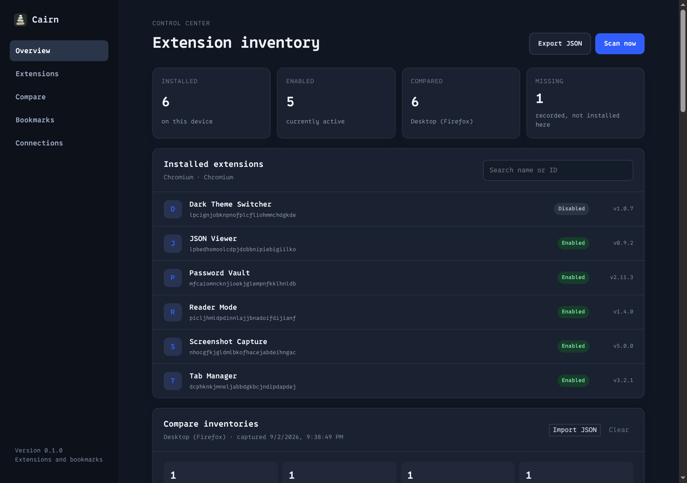
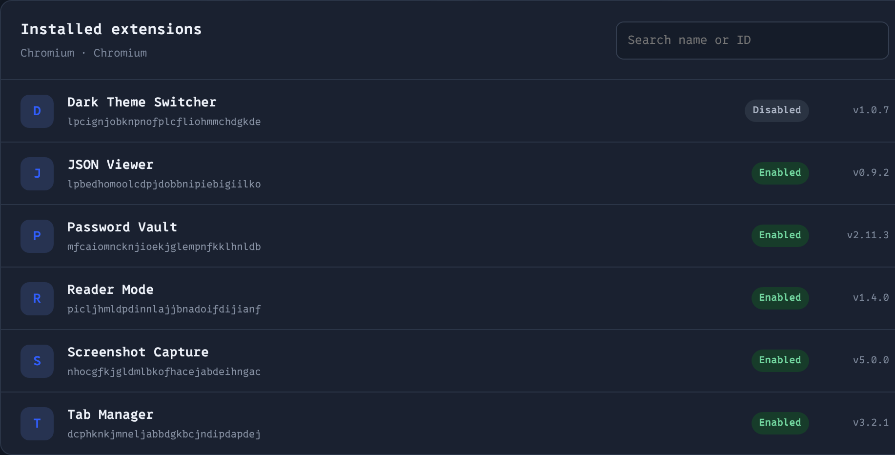
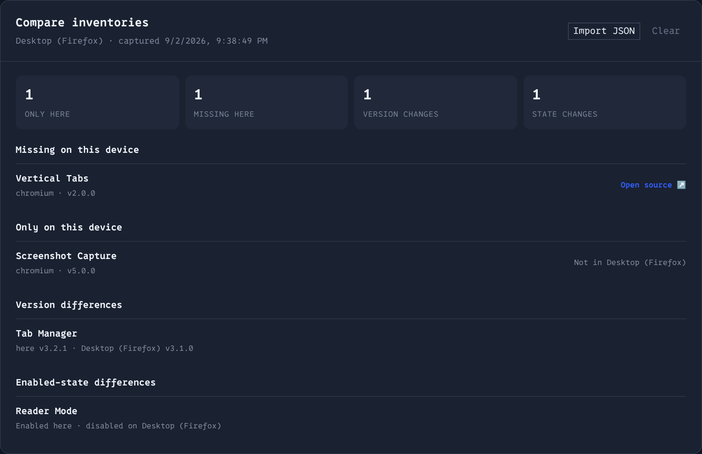
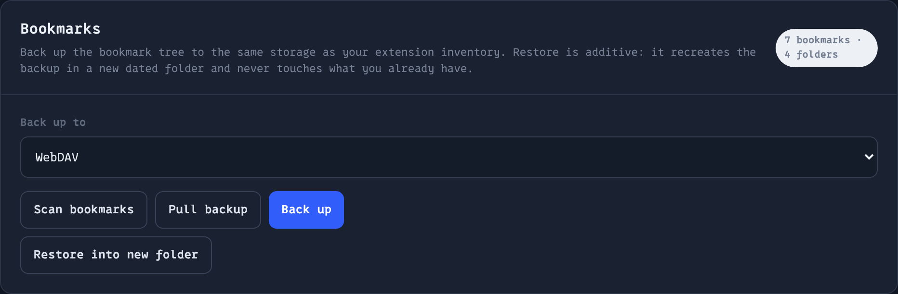
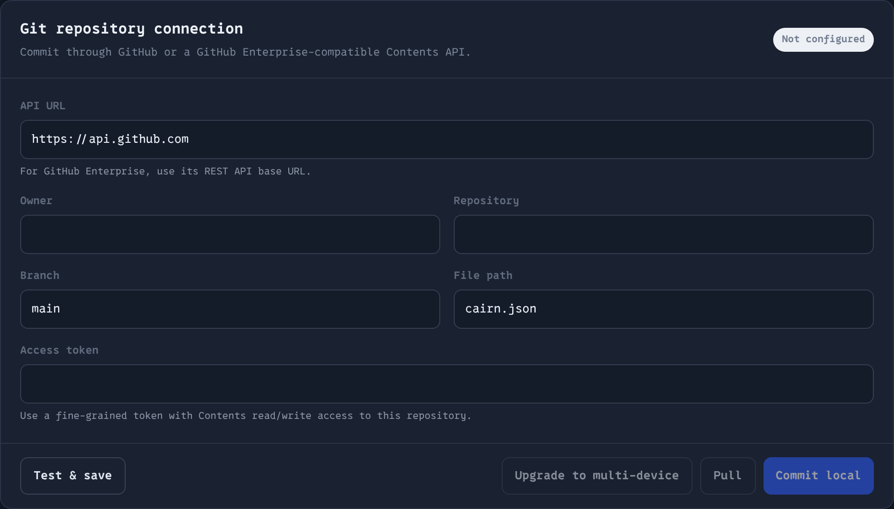

# Cairn

*A cairn is a stack of stones you build yourself to mark a trail, so you can
find your way back — which is what this does for a browser setup.*

Cairn records which extensions you have installed and backs up your bookmarks,
then stores both in a place **you** control: Gitea, GitHub, WebDAV, or
S3-compatible object storage. It runs entirely in the browser. There is no
companion binary, no account, and no server of ours.

Chromium-family browsers (including [Helium](https://helium.computer)) and
Firefox, from one codebase.

[](https://github.com/t1nk333r/cairn/actions/workflows/ci.yml)
[](LICENSE)



## Install

Grab the files from the [latest release](https://github.com/t1nk333r/cairn/releases/latest).

**Firefox** — download `cairn-<version>.xpi` and open it. Mozilla signs the
file for self-hosting, so release Firefox installs it without complaint.
Updates are manual for now: Cairn publishes no update manifest, so install the
next `.xpi` the same way.

**Chromium, Helium, Brave, Edge** — download `cairn-<version>-chrome.zip`,
unzip it, then go to `chrome://extensions`, turn on **Developer mode**, and
choose **Load unpacked** on the unzipped folder.

Google Chrome refuses to install any extension from outside the Web Store, and
that block applies to signed `.crx` files too — Load unpacked is the only route
until Cairn is listed. Some Chromium forks are more permissive; if yours
accepts a `.crx`, build one with `npm run pack:crx` and your own signing key.

The `.xpi` and the `.crx` are not interchangeable. They are different package
formats with different signatures: the `.xpi` is inert in Chromium, and a
`.crx` is inert in Firefox.

## What it does

**Takes an inventory of your extensions.** Cairn reads the browser's own
extension-management API — never your profile directory — and records each
extension's id, name, version, and enabled state. It recaptures automatically
when you install, remove, enable, or disable something, and it always leaves
itself out of the record.



**Compares two devices.** Pull an inventory from your remote, or import a JSON
export, and Cairn reports four kinds of difference: extensions only the other
device has, extensions only this one has, version mismatches, and
enabled-state mismatches. Each missing extension links out to its listing so
you can install it yourself.



**Backs up bookmarks.** The whole tree goes to the same storage as your
inventory. Restore is deliberately **additive**: it rebuilds the backup inside
a new dated folder under Other Bookmarks and never moves, renames, or deletes
anything you already have. If you don't want it, delete that one folder.



**Keeps several devices in one document.** The multi-device format gives every
browser its own section, so a second device syncing to the same remote adds to
the inventory instead of overwriting it. Writes are conditional — an ETag or a
commit SHA — and a merge only ever touches the merging device's own entries, so
two devices syncing at once cannot lose each other's data. Converting an
existing remote to that format is an explicit, one-time action you take from
any device.



Setup guides: [Gitea](docs/GITEA_SETUP.md) ·
[GitHub](docs/GITHUB_SETUP.md) · [S3](docs/S3_SETUP.md). WebDAV needs only a
collection URL and credentials.

Screenshots come from a scratch profile holding sample extensions, so the names
above are placeholders rather than recommendations.

## What it does not do

Being clear about this is the point of the section.

- **It cannot install extensions for you.** No browser lets an extension
  silently install other extensions, and Cairn does not pretend otherwise. It
  tells you what is missing and links you to it.
- **No guided restore or enabled-state reconciliation yet.** Compare shows the
  differences; acting on them is manual.
- **No encryption yet.** Anything you sync is readable by whoever can read the
  storage you chose. Use a private repository or bucket.
- **A Firefox add-on will not match its Chromium counterpart.** Identity is
  keyed per browser family, so the same product installed on both shows up as
  two separate records.
- **Bookmarks are not merged across devices.** The newest backup wins, guarded
  by a version check. Extension inventories *are* merged per device.

## Privacy and safety

- Cairn never reads or copies browser profile databases or extension data
  directories. Everything comes from the browser's own APIs.
- It requests three permissions: `management`, `storage`, and `bookmarks`.
  Access to your storage host is requested at runtime, only for the host you
  typed in.
- Credentials stay in extension storage on your device and are sent only to
  the endpoint you configured. Credentialed requests refuse redirects
  outright, so an authorization header or a request signature can never be
  replayed to another host.
- Repository paths and branch names are validated before use, and inventory
  source links are restricted to http and https.

## Development

Requires Node.js 22 or newer.

```bash
npm ci          # not `npm install` — see below
npm test
npm run typecheck
npm run build          # .output/chrome-mv3/
npm run build:firefox  # .output/firefox-mv3/
```

Use `npm ci`. A partial `npm install` can leave the bundler's optional platform
binary missing, which then fails every build and test with an error that looks
unrelated.

For live development, `npm run dev` or `npm run dev:firefox`. Packaging is
`npm run zip`, `npm run zip:firefox`, `npm run pack:crx`, and
`npm run pack:xpi`; `npm run sign:xpi` submits a build to Mozilla for signing.

Releases are cut by tagging: `npm version <x.y.z> && git push --follow-tags`.
The manifest version is derived from `package.json`, and CI refuses to publish
a tag that disagrees with it.

See [PLAN.md](PLAN.md) for the architecture and the delivery sequence.

## Credits and license

Cairn is licensed under the GNU Affero General Public License, version 3 or
later (`AGPL-3.0-or-later`); the full text is in [LICENSE](LICENSE). AGPL was
chosen because Cairn is aimed at self-hosting — it keeps the source available
to anyone who runs a modified version as a network service.

The product structure adapts proven ideas from the MIT-licensed
[Bookmarkora](https://github.com/gygy/Bookmarkora); see
[BOOKMARKORA_ADAPTATION.md](BOOKMARKORA_ADAPTATION.md) for the mapping and the
limits of that reuse. An optional native companion for arbitrary-Git support,
informed by the MIT-licensed
[helium-sync-git](https://github.com/mdeloughry/helium-sync-git), was built and
then removed on 2026-08-31 in favour of staying browser-only; see
[HELIUM_SYNC_GIT_ADAPTATION.md](HELIUM_SYNC_GIT_ADAPTATION.md) for the
reasoning. Reused Bookmarkora code keeps its MIT notice in
[THIRD_PARTY_NOTICES.md](THIRD_PARTY_NOTICES.md).

Formerly `hsync`, renamed 2026-09-02.
